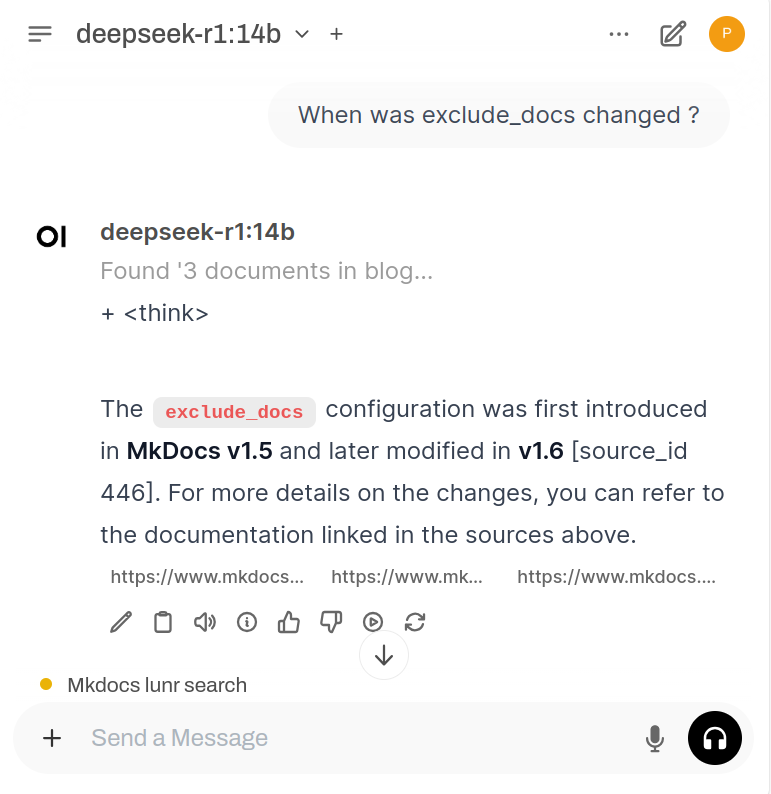

# OpenWebUI-Tools

OpenWebUI-Tools are a set of plugins to enhance the capabilities of OpenWebUI.

## Install instructions

Simply copy the desired `functions/*.py` code into a a function in OpenWebUI.

To create a new fuction go to `Workspaces -> Functions -> New Function (+ Icon)`

Once the function is created, you can use the wheel icon to add "Valves", to customize the intended parameters.

## Available Functions

### Search a mkdocs blog (mkdocs_lunr_search.py)

Mkdocs blogs have a built-in search powered my lunr.js, and by design their search index is available on the web.
You can specifiy your blog url as a Valve for this function.

